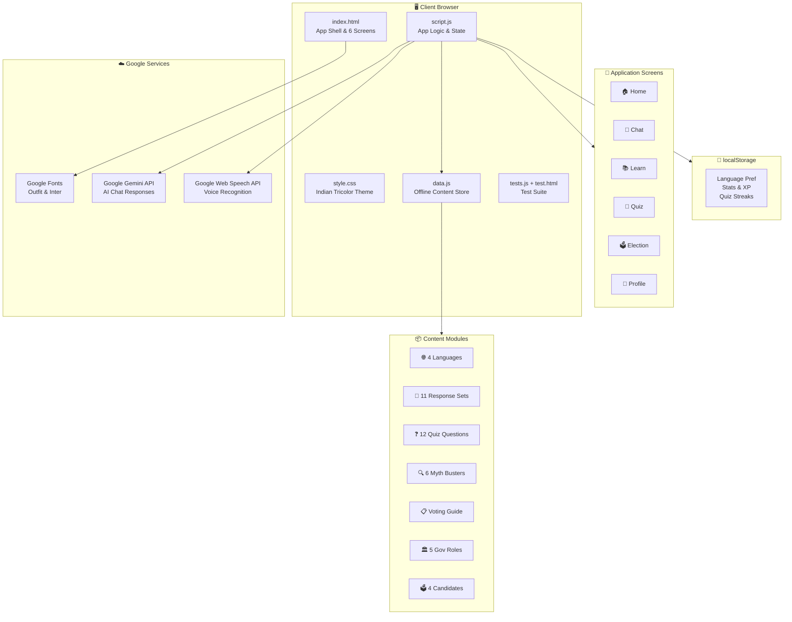
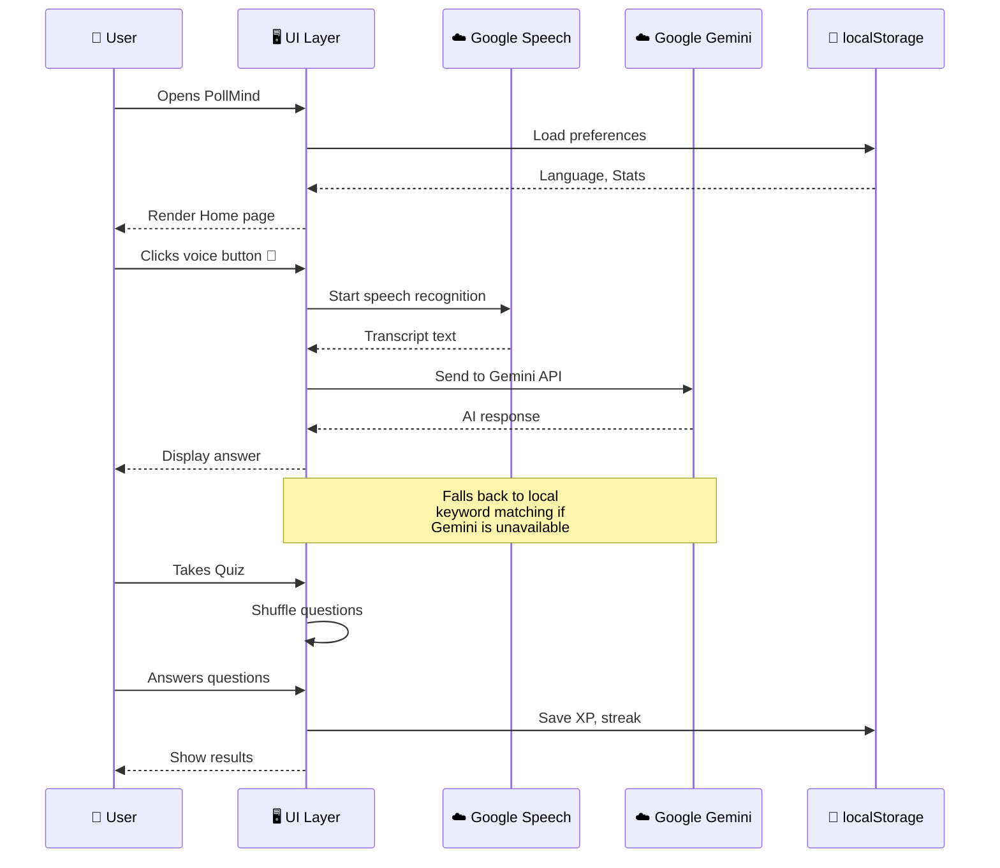

# 🗳️ PollMind — Indian Election AI Guide

> An interactive AI-powered assistant that educates Indian citizens about elections, democracy, and governance in a friendly, multilingual, and fact-based way.

<p align="center">
  
  
  
  
</p>

---

## 📋 Submission Details

| Field | Details |
|-------|---------|
| **Chosen Vertical** | Election & Democracy Education Assistant |
| **App Name** | PollMind |
| **Tech Stack** | Vanilla HTML, CSS, JavaScript (no frameworks) |
| **Google Services** | Google Gemini API, Web Speech API, Google Fonts |

---

## 🎯 Approach & Logic

### Problem
Most Indian citizens, especially first-time voters and students, lack clear understanding of how elections work, what their rights are, and how to identify misinformation. Existing resources are scattered, textbook-like, and not engaging.

### Solution
PollMind is a **conversational AI assistant** that makes election education interactive and accessible:

1. **AI-First Chat**: Users ask questions in natural language. The app uses **Google Gemini API** for intelligent responses, with a curated local knowledge base as offline fallback.
2. **Interactive Learning**: Instead of static text, users explore through simulations (mock elections), visual timelines, role-comparison cards, and myth-busting fact-checks.
3. **Gamification**: Quiz system with XP, streaks, and levels encourages repeated engagement.
4. **Inclusive Design**: Voice input via **Google Web Speech API**, multilingual UI (4 languages), and accessible markup for users with disabilities.

### Decision-Making Logic
- **Chat Engine**: Dual-mode — tries Google Gemini API first, falls back to keyword-based local matching for offline/no-key scenarios. This ensures the app always works.
- **Quiz System**: Questions are randomized from a 12-question bank, preventing memorization. XP is proportional to correct answers.
- **Simulation**: Uses the actual FPTP (First Past The Post) system India uses — the candidate with the most votes wins, no minimum threshold.
- **Language Detection**: Voice recognition language automatically matches the user's selected UI language.

---

## ✨ Features

| Feature | Description |
|---------|-------------|
| 💬 **AI Chat** | Google Gemini-powered Q&A with curated offline fallback |
| 🎤 **Voice Input** | Google Web Speech API for hands-free, accessibility-friendly interaction |
| 📚 **Learn Hub** | Election process timeline, governance roles, and myth busters |
| 🧠 **Quiz Arena** | Randomized quizzes with explanations, XP, and streak tracking |
| 🗳️ **Election Sim** | Mock FPTP election with animated vote-counting results |
| 📋 **Election Mode** | Step-by-step voting guide, document checklist, polling tips |
| 🌐 **Multilingual** | English, Hindi, Bengali, Tamil — with Google Fonts for proper rendering |
| 📴 **Offline First** | All content bundled locally — works without internet |
| ♿ **Accessible** | ARIA roles, keyboard nav, semantic HTML, large touch targets |
| 🔒 **Secure** | XSS prevention via input sanitization, no data sent to third parties |

---

## 🔌 Google Services Integration

### 1. Google Gemini API (AI Chat)
- **File**: `script.js` → `getGeminiResponse()`
- **Model**: `gemini-2.0-flash`
- **Purpose**: Generates intelligent, context-aware responses to election queries
- **Fallback**: Local keyword matching when API key is absent or request fails
- **Safety**: System prompt enforces neutrality, non-political tone, and topic boundaries

### 2. Google Web Speech API (Voice Input)
- **File**: `script.js` → `initVoiceInput()`
- **Purpose**: Enables voice-based question input for low-literacy and accessibility users
- **Languages**: Supports `en-IN`, `hi-IN`, `bn-IN`, `ta-IN` based on user's language selection
- **Note**: Uses Chrome's built-in speech recognition (powered by Google Cloud Speech)

### 3. Google Fonts
- **File**: `index.html` → `fonts.googleapis.com`
- **Fonts**: Outfit (headings), Inter (body text)
- **Purpose**: Professional, readable typography optimized for multilingual content

---

## 🏗️ System Architecture



### User Interaction Flow



---

## 📁 Project Structure

```
PollMind/
├── public/
│   ├── index.html      # App shell with 6 screens (Home, Chat, Learn, Quiz, Election, Profile)
│   ├── style.css       # Indian tricolor themed responsive styles
│   ├── script.js       # Main app logic + Gemini API + Web Speech API
│   ├── data.js         # All content data (offline-first, 12 quiz Qs, 11 chat topics)
│   ├── tests.js        # Automated test suite (100+ assertions)
│   └── test.html       # Test runner page
├── LICENSE             # GPL v3
└── README.md           # Documentation
```

---

## 🚀 Getting Started

```bash
# Clone the repository
git clone https://github.com/SupravoCoder/PollMind.git
cd PollMind

# Serve locally
npx serve public -p 3000

# Open in browser
# http://localhost:3000

# Run tests
# http://localhost:3000/test.html
```

### Optional: Enable Google Gemini AI
1. Get an API key from [Google AI Studio](https://aistudio.google.com/apikey)
2. Copy `public/config.example.js` to `public/config.js`
3. Replace `'your-gemini-api-key-here'` with your actual key in `config.js`
4. The chat will now use AI-powered responses instead of local matching

> **Never commit `config.js`** — it is listed in `.gitignore` to keep your key out of version control.

---

## 🎨 Design System

Indian Tricolor dark theme with subtle flag-colored background gradients:

| Color | Hex | Usage |
|-------|-----|-------|
| 🟠 Saffron | `#FF9933` | Primary buttons, active states, accents |
| ⚪ White | `#FFFFFF` | Text, gradient midpoint |
| 🟢 Green | `#138808` | Success states, secondary buttons |
| 🔵 Navy | `#000080` | Deep accents (Ashoka Chakra inspired) |
| ⬛ Background | `#0a0e1a` | Dark base with tricolor radial glows |

---

## ✅ Testing

Open `http://localhost:3000/test.html` to run the automated test suite. Tests cover:

- **Data Integrity**: All content modules have required fields and minimum entries
- **Language Labels**: All 4 languages have all required UI labels
- **Chat Matching**: Keyword-based responses return correct matches
- **Quiz Validation**: All questions have 4 options, valid correct index, and explanations
- **Security**: XSS prevention via `sanitize()` function
- **Gemini Config**: API configuration is properly structured
- **Simulation**: All candidates have complete data

---

## 🔒 Security Measures

- **XSS Prevention**: User messages use `textContent` (not `innerHTML`). A `sanitize()` function escapes HTML entities.
- **No Data Collection**: No user data is sent to any server. All state is in `localStorage`.
- **API Key Safety**: Gemini API key is optional and client-side only. For production, use a backend proxy.
- **Content Security**: System prompt prevents the AI from discussing non-election topics.

---

## 🤔 Assumptions

1. **Target Users**: Indian citizens (especially first-time voters, students, and low-literacy users)
2. **Browser**: Modern browsers with ES6+ support (Chrome recommended for voice input)
3. **Offline Priority**: Core features work without internet; Gemini AI is an enhancement, not a requirement
4. **Neutrality**: The app provides factual information only — no political opinions or party preferences
5. **Language**: Content is in English with UI labels translated to Hindi, Bengali, and Tamil
6. **Static Deployment**: No backend needed — can be hosted on GitHub Pages or any static host

---

## 📜 License

[GNU General Public License v3.0](LICENSE)

---

<p align="center">
  <b>PollMind is neutral, non-political, and fact-based.</b><br/>
  Built for education, not persuasion. 🇮🇳
</p>
