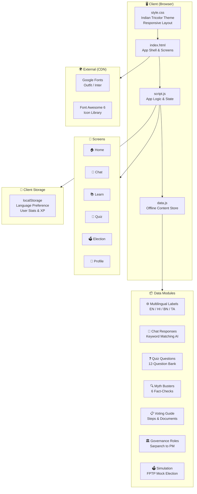
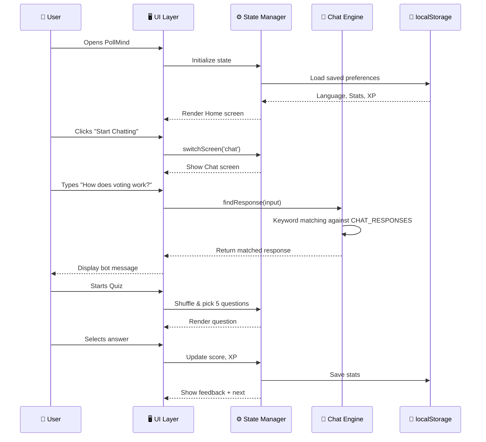

# 🗳️ PollMind — Indian Election AI Guide

> An interactive AI-powered assistant that educates Indian citizens about elections, democracy, and governance in a friendly, multilingual, and fact-based way.

<p align="center">
  
  
  
  
</p>

---

## ✨ Features

| Feature | Description |
|---------|-------------|
| 💬 **AI Chat Assistant** | Ask any question about Indian elections — voting process, EVMs, Voter ID, governance roles — and get instant, accurate answers |
| 📚 **Learn Hub** | Interactive cards covering Election Process (6-step timeline), Governance Roles (Sarpanch → PM), and Myth Busters |
| 🧠 **Quiz Arena** | Randomized 5-question quizzes with explanations, XP rewards, streak tracking, and difficulty levels |
| 🗳️ **Election Simulator** | Experience a mock FPTP election — vote for candidates and see animated results |
| 📋 **Election Mode** | Step-by-step voting guide, required document checklist, and polling day tips |
| 🌐 **Multilingual** | UI in English, Hindi (हिन्दी), Bengali (বাংলা), and Tamil (தமிழ்) |
| 📴 **Offline First** | All content bundled client-side — no API calls needed for core features |
| ♿ **Accessible** | ARIA roles, keyboard navigation, semantic HTML, large touch targets |

---

## 🏗️ System Architecture



### Component Interaction Flow



---

## 📁 Project Structure

```
PollMind/
├── public/
│   ├── index.html      # App shell with 6 screens
│   ├── style.css       # Indian tricolor themed styles
│   ├── script.js       # Main application logic
│   └── data.js         # All content data (offline-first)
├── LICENSE             # GPL v3
└── README.md           # This file
```

---

## 🚀 Getting Started

### Prerequisites
- Any modern web browser (Chrome, Firefox, Edge, Safari)
- Node.js (optional, for local dev server)

### Run Locally
```bash
# Clone the repository
git clone https://github.com/SupravoCoder/PollMind.git
cd PollMind

# Serve with any static server
npx serve public -p 3000

# Open in browser
open http://localhost:3000
```

---

## 🎨 Design System

The app uses a custom **Indian Tricolor** dark theme:

| Color | Hex | Usage |
|-------|-----|-------|
| 🟠 Saffron | `#FF9933` | Primary buttons, active states, accents |
| ⚪ White | `#FFFFFF` | Text, gradient midpoint |
| 🟢 Green | `#138808` | Success states, secondary buttons |
| 🔵 Navy | `#000080` | Accent, deep backgrounds |
| ⬛ Dark BG | `#0a0e1a` | App background with tricolor gradient glow |

---

## 🌐 Supported Languages

- 🇬🇧 English
- 🇮🇳 Hindi (हिन्दी)
- 🇮🇳 Bengali (বাংলা)
- 🇮🇳 Tamil (தமிழ்)

---

## 📜 License

This project is licensed under the [GNU General Public License v3.0](LICENSE).

---

## 🙏 Acknowledgements

- [Election Commission of India](https://eci.gov.in/) — Source of electoral information
- [Font Awesome](https://fontawesome.com/) — Icons
- [Google Fonts](https://fonts.google.com/) — Outfit & Inter typefaces

---

<p align="center">
  <b>PollMind is neutral, non-political, and fact-based.</b><br/>
  Built for education, not persuasion. 🇮🇳
</p>
